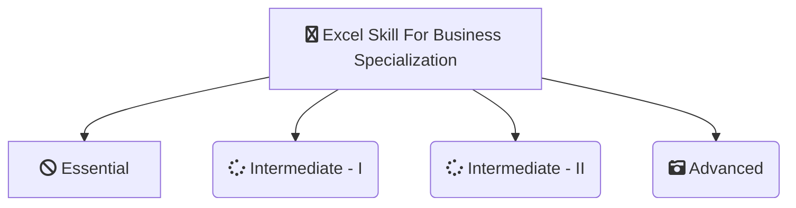

-------------------------------------------------------------------------------------------

-------------------------------------------------------------------------------------------

# [Macquarie-University - Excel Skills For Business Specialization](https://www.coursera.org/specializations/excel)
*This Repository Contains Solution to the Assignments of Excel Skills For Business - Macquarie-University  on Coursera Taught by 
[Nicky Bull](https://www.coursera.org/instructor/nicky-bull),
[Dr Prashan S. M. Karunaratne](https://www.coursera.org/specializations/excel#instructors),
[Professor Yvonne Breyer](https://www.coursera.org/instructor/yvonne-breyer)*

# About

-------------------------------------------------------------------------------------------

## WHAT YOU WILL LEARN

- Be comfortable navigating the Excel user interface, entering, manipulating and formatting data.
- Use formulas and functions to perform calculations on data. Automate choices and data lookups using functions.
- Analyze data and present the results in a user-friendly way. Create charts and tables that effectively summarize raw data.
- Create easy-to-use spreadsheets. Validate data, find and correct errors. Create navigation aids for large workbooks.

---

## About this Specialization

This specialization is intended for anyone who seeks to develop one of the most critical and fundamental digital skills today. Spreadsheet software remains one of the most ubiquitous pieces of software used in workplaces across the world. Learning to confidently operate this software means adding a highly valuable asset to your employability portfolio. In the United States alone, millions of job advertisements requiring Excel skills are posted every day. Research by Burning Glass Technologies and Capital One shows that digital skills lead to higher income and better employment opportunities. At a time when digital skills jobs are growing much faster than non-digital jobs, completing this specialization will position you way ahead of others.

In this Specialization, learners develop advanced Excel Skills for Business.  Upon completing the four courses in this Specialization, learners can design sophisticated spreadsheets, including professional dashboards, and perform complex calculations using advanced Excel features and techniques. Learners have acquired the skills to manage large datasets efficiently, extract meaningful information from datasets, present data and extract information effectively. In addition, learners have mastered the skills needed to validate data and prevent errors in spreadsheets, create automation, apply advanced formulas and conditional logic to help make decisions and create spreadsheets that help forecast and model data.

---

## Applied Learning Project
The best way to learn Excel is to use Excel. In this specialization, learners will solve a broad range of business problems as they apply the Excel skills and techniques they learn along the way. This specialization uses downloadable Excel workbooks and full data sets with applied examples and practical challenge exercises. This provides learners with countless opportunities to practice their Excel skills while discovering new and useful productivity features of Excel for a variety of business contexts.

-------------------------------------------------------------------------------------------------------------

## There are 3 Courses in this Specialization

### COURSE 1
### Mathematics for Machine Learning: Linear Algebra

In this course on Linear Algebra we look at what linear algebra is and how it relates to vectors and matrices. Then we look through what vectors and matrices are and how to work with them, including the knotty problem of eigenvalues and eigenvectors, and how to use these to solve problems. Finally  we look at how to use these to do fun things with datasets - like how to rotate images of faces and how to extract eigenvectors to look at how the Pagerank algorithm works.

Since we're aiming at data-driven applications, we'll be implementing some of these ideas in code, not just on pencil and paper. Towards the end of the course, you'll write code blocks and encounter Jupyter notebooks in Python, but don't worry, these will be quite short, focussed on the concepts, and will guide you through if you’ve not coded before.

At the end of this course you will have an intuitive understanding of vectors and matrices that will help you bridge the gap into linear algebra problems, and how to apply these concepts to machine learning.

* [Mathematics for Machine Learning: Linear Algebra](https://github.com/shantanu1109/Coursera-Imperial-College-of-London-Mathematics-For-Machine-Learning-Specialization/tree/main/Course-1-Mathematics%20for%20Machine%20Learning:%20Linear%20Algebra)

### COURSE 2
### Mathematics for Machine Learning: Multivariate Calculus

This course offers a brief introduction to the multivariate calculus required to build many common machine learning techniques. We start at the very beginning with a refresher on the “rise over run” formulation of a slope, before converting this to the formal definition of the gradient of a function. We then start to build up a set of tools for making calculus easier and faster. Next, we learn how to calculate vectors that point up hill on multidimensional surfaces and even put this into action using an interactive game. We take a look at how we can use calculus to build approximations to functions, as well as helping us to quantify how accurate we should expect those approximations to be. We also spend some time talking about where calculus comes up in the training of neural networks, before finally showing you how it is applied in linear regression models. This course is intended to offer an intuitive understanding of calculus, as well as the language necessary to look concepts up yourselves when you get stuck. Hopefully, without going into too much detail, you’ll still come away with the confidence to dive into some more focused machine learning courses in future.

* [Mathematics for Machine Learning: Multivariate Calculus](https://github.com/shantanu1109/Coursera-Imperial-College-of-London-Mathematics-For-Machine-Learning-Specialization/tree/main/Course-2-Mathematics%20for%20Machine%20Learning:%20Multivariate%20Calculus)

### COURSE 3
### Mathematics for Machine Learning: PCA

This intermediate-level course introduces the mathematical foundations to derive Principal Component Analysis (PCA), a fundamental dimensionality reduction technique. We'll cover some basic statistics of data sets, such as mean values and variances, we'll compute distances and angles between vectors using inner products and derive orthogonal projections of data onto lower-dimensional subspaces. Using all these tools, we'll then derive PCA as a method that minimizes the average squared reconstruction error between data points and their reconstruction.

At the end of this course, you'll be familiar with important mathematical concepts and you can implement PCA all by yourself. If you’re struggling, you'll find a set of jupyter notebooks that will allow you to explore properties of the techniques and walk you through what you need to do to get on track. If you are already an expert, this course may refresh some of your knowledge.

The lectures, examples and exercises require:
1. Some ability of abstract thinking
2. Good background in linear algebra (e.g., matrix and vector algebra, linear independence, basis)
3. Basic background in multivariate calculus (e.g., partial derivatives, basic optimization)
4. Basic knowledge in python programming and numpy

* [Mathematics for Machine Learning: PCA](https://github.com/shantanu1109/Coursera-Imperial-College-of-London-Mathematics-For-Machine-Learning-Specialization/tree/main/Course-3-Mathematics%20for%20Machine%20Learning:%20PCA)

-------------------------------------------------------------------------------------------------------------

## Certificate

1. [Mathematics for Machine Learning: Linear Algebra](https://www.coursera.org/account/accomplishments/verify/S8WAEQ2VPKDK)
2. [Mathematics for Machine Learning: Multivariate Calculus](https://www.coursera.org/account/accomplishments/verify/MGJS87FW7MSL)
3. [Mathematics for Machine Learning: PCA](https://www.coursera.org/account/accomplishments/verify/NPPBWFJQ23QZ)
4. [Mathematics for Machine Learning Specialization (Final Certificate)](https://www.coursera.org/account/accomplishments/specialization/SKN7EYANZWAT)

--------------------------------------------------------------------------------------------------------------

## References
1. [Mathematics for Machine Learning: Linear Algebra](https://www.coursera.org/learn/linear-algebra-machine-learning?specialization=mathematics-machine-learning)
2. [Mathematics for Machine Learning: Multivariate Calculus](https://www.coursera.org/learn/multivariate-calculus-machine-learning?specialization=mathematics-machine-learning)
3. [Mathematics for Machine Learning: PCA](https://www.coursera.org/learn/pca-machine-learning?specialization=mathematics-machine-learning)

----------------------------------------------------------------------------------------------------------------

## 📝 Disclaimer 
I made this repository as *a reference*. Please do not copy paste the solution as is. You can find the solution if you read the instruction carefully. 

 
## 📝 License
The gem is available as open source under the terms of the [MIT License](https://opensource.org/licenses/MIT).
 
-----------------------------------------------------------------------------------------------------------------
