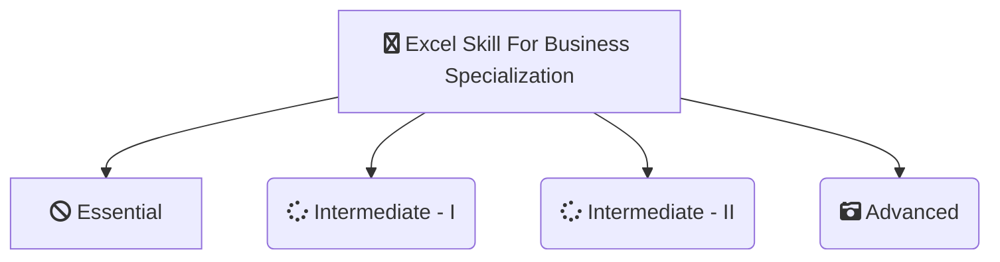

-------------------------------------------------------------------------------------------

-------------------------------------------------------------------------------------------

# [Macquarie-University - Excel Skills For Business Specialization](https://www.coursera.org/specializations/excel)
*This Repository Contains Solution to the Assignments of Excel Skills For Business - Macquarie-University  on Coursera Taught by 
[Nicky Bull](https://www.coursera.org/instructor/nicky-bull),
[Dr Prashan S. M. Karunaratne](https://www.coursera.org/specializations/excel#instructors),
[Professor Yvonne Breyer](https://www.coursera.org/instructor/yvonne-breyer)*

# About

-------------------------------------------------------------------------------------------

## WHAT YOU WILL LEARN

- Be comfortable navigating the Excel user interface, entering, manipulating and formatting data.
- Use formulas and functions to perform calculations on data. Automate choices and data lookups using functions.
- Analyze data and present the results in a user-friendly way. Create charts and tables that effectively summarize raw data.
- Create easy-to-use spreadsheets. Validate data, find and correct errors. Create navigation aids for large workbooks.

---

## About this Specialization

This specialization is intended for anyone who seeks to develop one of the most critical and fundamental digital skills today. Spreadsheet software remains one of the most ubiquitous pieces of software used in workplaces across the world. Learning to confidently operate this software means adding a highly valuable asset to your employability portfolio. In the United States alone, millions of job advertisements requiring Excel skills are posted every day. Research by Burning Glass Technologies and Capital One shows that digital skills lead to higher income and better employment opportunities. At a time when digital skills jobs are growing much faster than non-digital jobs, completing this specialization will position you way ahead of others.

In this Specialization, learners develop advanced Excel Skills for Business.  Upon completing the four courses in this Specialization, learners can design sophisticated spreadsheets, including professional dashboards, and perform complex calculations using advanced Excel features and techniques. Learners have acquired the skills to manage large datasets efficiently, extract meaningful information from datasets, present data and extract information effectively. In addition, learners have mastered the skills needed to validate data and prevent errors in spreadsheets, create automation, apply advanced formulas and conditional logic to help make decisions and create spreadsheets that help forecast and model data.

---

## Applied Learning Project
The best way to learn Excel is to use Excel. In this specialization, learners will solve a broad range of business problems as they apply the Excel skills and techniques they learn along the way. This specialization uses downloadable Excel workbooks and full data sets with applied examples and practical challenge exercises. This provides learners with countless opportunities to practice their Excel skills while discovering new and useful productivity features of Excel for a variety of business contexts.

-------------------------------------------------------------------------------------------------------------

## There are 3 Courses in this Specialization

### COURSE 1
### Excel Skills for Business: Essentials

In this first course of the specialization Excel Skills for Business, you will learn the essentials of Microsoft Excel. Within six weeks, you will be able to expertly navigate the Excel user interface, perform basic calculations with formulas and functions, professionally format spreadsheets, and create visualizations of data through charts and graphs.

Whether you are self-taught and want to fill in the gaps for better efficiency and productivity, or whether you have never used Excel before, this course will set you up with a solid foundation to become a confident user and develop more advanced skills in later courses. 

The best way to learn Excel is to use Excel. In this course, learners will solve a broad range of business problems as they apply the Excel skills and techniques they learn along the way. This course uses downloadable Excel workbooks and full data sets with applied examples and practical challenge exercises. This provides learners with countless opportunities to practice their Excel skills while discovering new and useful productivity features of Excel for a variety of business contexts.

Spreadsheet software is one of the most ubiquitous pieces of software used in workplaces across the world. Learning to confidently operate this software means adding a highly valuable asset to your employability portfolio. At a time when digital skills jobs are growing much faster than non-digital jobs, make sure to position yourself ahead of the rest by adding Excel skills to your employment portfolio.

* [Excel Skills for Business: Essentials](https://github.com/shantanu1109/Coursera-Macquarie-University-Excel-Skills-For-Business-Specialization/tree/main/Course-1-Excel-Skills-for-Business-Essentials)

### COURSE 2
### Excel Skills for Business: Intermediate - I

Spreadsheet software remains one of the most ubiquitous pieces of software used in workplaces across the world. Learning to confidently operate this software means adding a highly valuable asset to your employability portfolio. In the United States alone, millions of job advertisements requiring Excel skills are posted every day. Research by Burning Glass Technologies and Capital One shows that digitals skills lead to higher income and better employment opportunities at a time when digital skills job are growing much faster than non-digital jobs.

In this second course of our Excel specialization Excel Skills for Business you will build on the strong foundations of the Essentials course. Intermediate Skills I will expand your Excel knowledge to new horizons. You are going to discover a whole range of skills and techniques that will become a standard component of your everyday use of Excel. In this course, you will build a solid layer of more advanced skills so you can manage large datasets and create meaningful reports. These key techniques and tools will allow you to add a sophisticated layer of automation and efficiency to your everyday tasks in Excel.

Once again, we have brought together a great teaching team that will be with you every step of the way. Prashan and Nicky will guide you through each week (and I am even going to make a guest appearance in Week 5 to help you learn about my favourite tool in Excel - shh, no spoilers!). Work through each new challenge step-by-step and in no time you will surprise yourself by how far you have come. This time around, we are going to follow Uma's trials and tribulations as she is trying to find her feet in a new position in the fictitious company PushPin. For those of you who have done the Essentials course, you will already be familiar with the company. Working through her challenges which are all too common ones that we encounter everyday, will help you to more easily relate to the skills and techniques learned in each week and apply them to familiar and new contexts.

* [Excel Skills for Business: Intermediate - I](https://github.com/shantanu1109/Coursera-Macquarie-University-Excel-Skills-For-Business-Specialization/tree/main/Course-2-Excel-Skills-for-Business-Intermediate-I)

### COURSE 3
### Excel Skills for Business: Intermediate - II

Spreadsheet software remains one of the most ubiquitous pieces of software used in workplaces across the world. Learning to confidently operate this software means adding a highly valuable asset to your employability portfolio. In this third course of our Excel specialization Excel Skills for Business you will delve deeper into some of the most powerful features Excel has to offer. When you have successfully completed the course you will be able to

Check for and prevent errors in spreadsheets; 
Create powerful automation in spreadsheets; 
Apply advanced formulas and conditional logic to help make informed business decisions; and
Create spreadsheets that help forecast and model data. 

Once again, we have brought together a great teaching team that will be with you every step of the way. Nicky, Prashan and myself will guide you through each week. As we are exploring these more advanced topics, we are following Alex who is an Excel consultant called in by businesses that experience issues with their spreadsheets.

* [Excel Skills for Business: Intermediate - II](https://github.com/shantanu1109/Coursera-Macquarie-University-Excel-Skills-For-Business-Specialization/tree/main/Course-3-Excel-Skills-for-Business-Intermediate-II)

### COURSE 4
### Excel Skills for Business: Advanced

Spreadsheet software remains one of the most ubiquitous pieces of software used in workplaces around the world. Learning to confidently operate this software means adding a highly valuable asset to your employability portfolio. Across the globe, millions of job advertisements requiring Excel skills are posted every day. At a time when digital skills jobs are growing much faster than non-digital jobs, completing this course will position you ahead of others, so keep reading.

In this last course of our Specialization Excel Skills for Business you will build on the strong foundations of the first three courses: Essentials, Intermediate I + II.  In the Advanced course, we will prepare you to become a power user of Excel - this is your last step before specializing at a professional level. The topics we have prepared will challenge you as you learn how to use advanced formula techniques and sophisticated lookups. You will clean and prepare data for analysis, and learn how to work with dates and financial functions. An in-depth look at spreadsheet design and documentation will prepare you for our big finale, where you will learn how to build professional dashboards in Excel.

* [Excel Skills for Business: Advanced](https://github.com/shantanu1109/Coursera-Macquarie-University-Excel-Skills-For-Business-Specialization/tree/main/Course-4-Excel-Skills-for-Business-Advanced)

-------------------------------------------------------------------------------------------------------------

## Certificate

1. [Excel Skills for Business: Essentials](https://www.coursera.org/account/accomplishments/verify/897HC2Z74LFW)
2. [Excel Skills for Business: Intermediate - I](https://www.coursera.org/account/accomplishments/verify/ZBP5B65WTJCR)
3. [Excel Skills for Business: Intermediate - II](https://www.coursera.org/account/accomplishments/verify/W5ZNBZT52DME)
4. [Excel Skills for Business: Advanced](https://www.coursera.org/account/accomplishments/verify/M2URRAJ8TCGR)
5. [Excel Skill for Business Specialization (Final Certificate)](https://www.coursera.org/account/accomplishments/specialization/SY4QD6RK62TQ)

--------------------------------------------------------------------------------------------------------------

## References
1. [Excel Skills for Business: Essentials](https://www.coursera.org/learn/excel-essentials?specialization=excel)
2. [Excel Skills for Business: Intermediate - I](https://www.coursera.org/learn/excel-intermediate-1?specialization=excel)
3. [Excel Skills for Business: Intermediate - II](https://www.coursera.org/learn/excel-intermediate-2?specialization=excel)
4. [Excel Skills for Business: Advanced](https://www.coursera.org/learn/excel-advanced?specialization=excel)

----------------------------------------------------------------------------------------------------------------

## 📝 Disclaimer 
I made this repository as *a reference*. Please do not copy paste the solution as is. You can find the solution if you read the instruction carefully. 

 
## 📝 License
The gem is available as open source under the terms of the [MIT License](https://opensource.org/licenses/MIT).
 
-----------------------------------------------------------------------------------------------------------------
